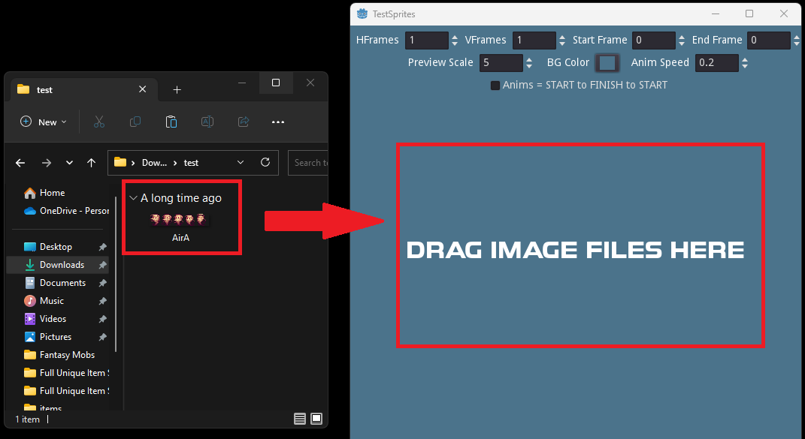
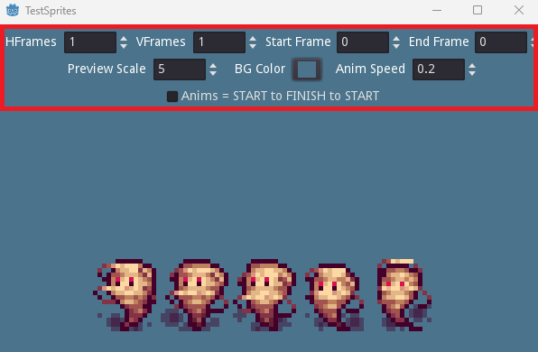
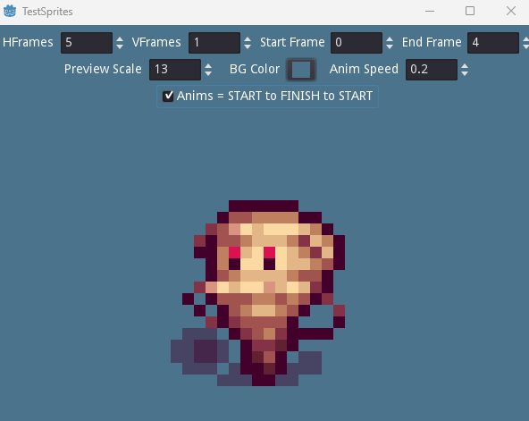

# sprite-visualizer
 A simple Godot application that allows someone to drag and drop pixel art assets that have animations and configure them while visualizing them

## Steps to Use

1. Open the tool (the .exe)
2. Drag an image file into the tool window 
3. It should now be inside the tool and ready to configure
4. The settings are all common ways to animate sprites. See some explanations of each setting below

## Settings Explained

- **HFrames**: How many columns your sprite has (how many left-to-right images per row)
- **VFrames**: How many rows your sprite has (how many top-to-bottom images per column)
- **Start Frame**: Which frame to start the animation from each loop. Frames go from 0 (top-left) to the end of the row, then to the start of the next row, etc.
- **End Frame**: Which frame to end the animation on each loop
- **Preview Scale**: Increases (or decreases) the size of the preview of your sprite(s)
- **BG Color**: A color picker that simply changes the background of the preview space. Useful if you have different colored sprites and want to see them on a certain background type/color
- **Anim Speed**: The animation speed between each frame
- **Anims Checkbox**: Determines the looping pattern. UNCHECKED = it will go from frame 0 to 5, then 0 to 5, etc. CHECKED = it will go from frame 0 to 5, then from 5 to 0. Some sprite sheets use different animation loops; so try both!

## Screenshots

### Drag your sprite into the tool

### Use the settings to find your perfect animation

### Profit!

